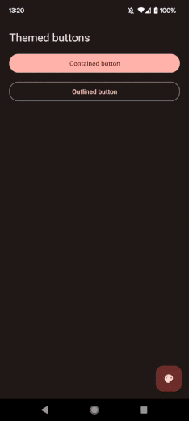

<div align="center">


</div>

<div align="center">

[](https://github.com/pchmn/expo-material3-theme/blob/main/LICENSE)
[](https://www.npmjs.com/package/@pchmn/expo-material3-theme)
[](https://www.android.com)
[](https://developer.apple.com/ios)

</div>

<h1 align="center">Expo Material 3 Theme</h1>

<div align="center">

This [expo module](https://docs.expo.dev/modules/overview/) allows you retrieve the [Material 3 dynamic theme](https://developer.android.com/develop/ui/views/theming/dynamic-colors) from Android 12+ devices, so that you can use it in your expo (or bare react-native) app.

For devices not compatible (iOS or older Android versions) a fallback theme is returned.

</div>

<br>

## ✨ Features

- Retrieve Material 3 dynamic theme from Android 12+ devices (or a fallback theme if device is not compatible)
- Generate Material 3 theme based on a source color (using [`@material/material-color-utilities`](https://github.com/material-foundation/material-color-utilities/tree/main/typescript))
- Material 3 theme compatible with [`react-native-paper`](https://callstack.github.io/react-native-paper/)

<br>

<div align="center">



</div>
<br>

## Installation

### Installation in managed Expo projects

> This library works with Expo Go, but you won't be able to retrieve the system theme (you'll get a fallback theme) because it requires custom native code and Expo Go [doesn't support it](https://docs.expo.dev/workflow/customizing/)


```
npx expo install @pchmn/expo-material3-theme
```

### Installation in bare React Native projects

For bare React Native projects, you must ensure that you have [installed and configured the `expo` package](https://docs.expo.dev/bare/installing-expo-modules/) before continuing.

```sh
npx expo install @pchmn/expo-material3-theme
npx pod-install
```

## Usage

### Retrieve system theme

A basic usage would be to retrieve the Material 3 theme from user device (or a fallback theme if not supported) by using `useMaterial3Theme` hook:

```tsx
import { useMaterial3Theme } from '@pchmn/expo-material3-theme';
import { useColorScheme, View, Button } from 'react-native';

function App() {
  const colorScheme = useColorScheme();
  // If the device is not compatible, it will return a theme based on the fallback source color (optional, default to #6750A4)
  const { theme } = useMaterial3Theme({ fallbackSourceColor: '#3E8260' });

  return (
    <View style={{ backgroundColor: theme[colorScheme].background }}>
      <Button color={theme[colorScheme].primary}>Themed button</Button>
    </View>
  );
}
```

### Use a custom theme

If you want to use a theme based on a specific color instead of the system theme, just pass the `sourceColor` param to `useMaterial3Theme` hook:

```tsx
import { useMaterial3Theme } from '@pchmn/expo-material3-theme';
import { useColorScheme, View, Button } from 'react-native';

function App() {
  const colorScheme = useColorScheme();
  // Theme returned will be based on #3E8260 color
  const { theme } = useMaterial3Theme({ sourceColor: '#3E8260' });

  return (
    <View style={{ backgroundColor: theme[colorScheme].background }}>
      <Button color={theme[colorScheme].primary}>Themed button</Button>
    </View>
  );
}
```

### Change theme

You may also want to update the theme by generating a new one, or go back to the default theme (to let users personalize your app for example). You can do it with `useMaterial3Theme` hook:

```tsx
import { useMaterial3Theme } from '@pchmn/expo-material3-theme';
import { useColorScheme, View, Button } from 'react-native';

function App() {
  const colorScheme = useColorScheme();
  const { theme, updateTheme, resetTheme } = useMaterial3Theme();

  return (
    <View style={{ backgroundColor: theme[colorScheme].background }}>
      {/* Update theme by generating a new one based on #3E8260 color */}
      <Button onPress={() => updateTheme('#3E8260')}>Update theme</Button>
      {/* Reset theme to default (system or fallback) */}
      <Button onPress={() => resetTheme()}>Reset theme</Button>
    </View>
  );
}
```

> ℹ️ `updateTheme()` and `resetTheme()` will change the theme returned by `useMaterial3Theme()`, it will not change theme at system level

### Usage with `react-native-paper`

#### Basic example
`@pchmn/expo-material3-theme` provides a theme compatible with `react-native-paper`, so you can combine both libraries easily:

```tsx
import { useMaterial3Theme } from '@pchmn/expo-material3-theme';
import { useMemo } from 'react';
import { useColorScheme } from 'react-native';
import { Button, MD3DarkTheme, MD3LightTheme, Provider as PaperProvider } from 'react-native-paper';

function App() {
  const colorScheme = useColorScheme();
  const { theme } = useMaterial3Theme();

  const paperTheme = useMemo(
    () =>
      colorScheme === 'dark' ? { ...MD3DarkTheme, colors: theme.dark } : { ...MD3LightTheme, colors: theme.light },
    [colorScheme, theme]
  );

  return (
    <PaperProvider theme={paperTheme}>
      <Button>Themed react native paper button</Button>
    </PaperProvider>
  );
}
```

#### Advanced usage

<details>
  <summary>Override <code>react-native-paper</code> theme (Typescript)</summary>
  <br>

  Some [colors](https://github.com/pchmn/expo-material3-theme/blob/main/src/ExpoMaterial3Theme.types.ts#L54-L61) present in `Material3Theme` from this library are not present in `MD3Theme` of `react-native-paper`. You can create a typed `useAppTheme()` hook and use it instead of `useTheme()` hook to fix this :

  ```ts
  import { Material3Scheme } from '@pchmn/expo-material3-theme';
  import { MD3Theme, useTheme } from 'react-native-paper';

  export const useAppTheme = useTheme<MD3Theme & { colors: Material3Scheme }>;

  // Now use useAppTheme() instead of useTheme()
  ```
</details>

<details>
  <summary>Create a <code>Material3ThemeProvider</code> that includes <code>PaperProvider</code></summary>

  ```tsx
  // Material3ThemeProvider.tsx
  import { Material3Scheme, Material3Theme, useMaterial3Theme } from '@pchmn/expo-material3-theme';
  import { createContext, useContext } from 'react';
  import { useColorScheme } from 'react-native';
  import {
    MD3DarkTheme,
    MD3LightTheme,
    MD3Theme,
    Provider as PaperProvider,
    ProviderProps,
    useTheme,
  } from 'react-native-paper';

  type Material3ThemeProviderProps = {
    theme: Material3Theme;
    updateTheme: (sourceColor: string) => void;
    resetTheme: () => void;
  };

  const Material3ThemeProviderContext = createContext<Material3ThemeProviderProps>({} as Material3ThemeProviderProps);

  export function Material3ThemeProvider({
    children,
    sourceColor,
    fallbackSourceColor,
    ...otherProps
  }: ProviderProps & { sourceColor?: string; fallbackSourceColor?: string }) {
    const colorScheme = useColorScheme();

    const { theme, updateTheme, resetTheme } = useMaterial3Theme({
      sourceColor,
      fallbackSourceColor,
    });

    const paperTheme =
      colorScheme === 'dark' ? { ...MD3DarkTheme, colors: theme.dark } : { ...MD3LightTheme, colors: theme.light };

    return (
      <Material3ThemeProviderContext.Provider value={{ theme, updateTheme, resetTheme }}>
        <PaperProvider theme={paperTheme} {...otherProps}>
          {children}
        </PaperProvider>
      </Material3ThemeProviderContext.Provider>
    );
  }

  export function useMaterial3ThemeContext() {
    const ctx = useContext(Material3ThemeProviderContext);
    if (!ctx) {
      throw new Error('useMaterial3ThemeContext must be used inside Material3ThemeProvider');
    }
    return ctx;
  }

  export const useAppTheme = useTheme<MD3Theme & { colors: Material3Scheme }>;


  // App.tsx
  import { Material3ThemeProvider, useAppTheme, useMaterial3ThemeContext } from '../Material3ThemeProvider';
  import { View, Button } from 'react-native';

  function App() {
    return (
      <Material3ThemeProvider>
        <AppContent />
      </Material3ThemeProvider>
    )
  }

  function AppContent() {
    const { updateTheme, resetTheme } = useMaterial3ThemeContext();
    // react-native-paper theme is always in sync
    const theme = useAppTheme();

    return (
      <View style={{ backgroundColor: theme.colors.background }}>
        {/* Update theme by generating a new one based on #3E8260 color */}
        <Button onPress={() => updateTheme('#3E8260')}>Update theme</Button>
        {/* Reset theme to default (system or fallback) */}
        <Button onPress={() => resetTheme()}>Reset theme</Button>
      </View>
    );
  }
  ```
</details>

## Example

You can see an example app in the [`/example`](./example/) folder.

### Android example

Extract [zip file](docs/example-apps.zip), and install `expo-material3-theme-example-android.apk` on your device.

### iOS example

This is a file for iOS simulator. Extract [zip file](docs/example-apps.zip), and drag and drop `expo-material3-theme-example-ios` into your emulator.

## [API Reference](docs/API.md)

- [`useMaterial3Theme`](docs/API.md#usematerial3theme)
- [`getMaterial3Theme`](docs/API.md#getmaterial3theme)
- [`createMaterial3Theme`](docs/API.md#creatematerial3theme)
- [`isDynamicThemeSupported`](docs/API.md#isdynamicthemesupported-boolean)

## ⚠️ Activity recreation

When Material 3 dynamic theme is changed on Android 12+ devices, it is a configuration change and the system will recreate an Activity.

This configuration change can't be disable: "Some configuration changes always cause the activity to restart. You can't disable them. For example, you can't disable the dynamic colors change introduced in API 32" (cf official [doc](https://developer.android.com/guide/topics/resources/runtime-changes#restrict-activity)).

So be aware that when users change their theme then go back to your app, all local state may be lost (and may cause some flickering) if your don't handle it.

## License

This project is released under the [MIT License](https://github.com/pchmn/firebase-cli-github-action/blob/main/license).
